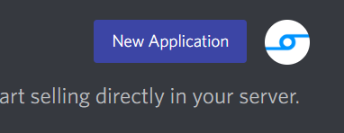
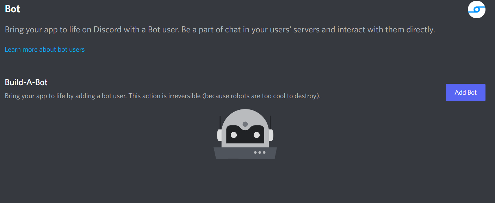
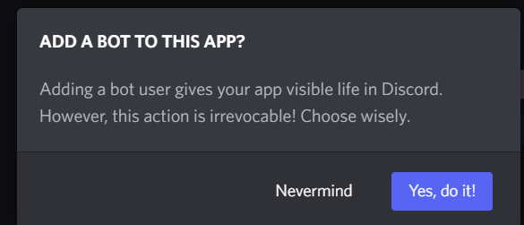

<p></p>

# Dispy


\
[](https://dispy-api-docs.readthedocs.io/en/latest/?badge=latest)
## Needs minimal 3.8 python version
Dispy is package for creating bots in Discord. This package use discord API and discord Gateway
for handle events or, for example, sending messages. Bot use for different goals; handle information
on your server, creating mini games in discord, auto moderation in your discord server and other.
For example, you can send messages use this code:
```python
import disspy  # Import package

bot = disspy.DisBot(token="YOUR_TOKEN", application_id=00000)  # Create a bot

async def test():  # Send messages needs to execute in the async function
    channel_id = 000000  # Yours channel id
    channel = bot.get_channel(channel_id)  # Get the channel for sending to this channel a message
    
    await channel.send(content="Message!")  # Sending a message
    
if __name__ == '__main__':  # If file is started as a main file
    from asyncio import run  # Import asyncio.run
    
    run(test())  # Run async function
    
```
# Mini Tutorial
<p>What's token? For starting using this package, you must create bot in
<a href="https://discord.com/developers/applications">Discord Developer Portal</a></p>
<p>Just click on the "New application" button</p>
<p></p><p>Come up with a name and click "Create" button</p>
<p></p><p>Put application id in your mind and click to the "Bot" button</p>
<p></p><p>Click the "Add bot" button</p>
<p></p><p>Click "Yes, do it!"</p>
<p></p><p>Click "Reset Token"</p>
<p></p><p>Copy token to clipboard</p>
<p></p>

Now need open cmd and type "pip install --upgrade disspy" command and click the "Enter" button.
After this, open your IDE or file editor, create new python file and type this code with your data:
```python
import disspy

token = "TOKEN_FROM_SITE"
application_id = 0000000  # Application id from your mind

bot = disspy.DisBot(token=token, application_id=application_id)  # You created bot!
```
*This is creating bot in this library*

Now you can add events to bot (for example, on_ready(), on_messagec() and other) and in end of file you must type this text:
```python
bot.run()
```
This command run bot. After this command you can see that bot is online. Tutorial is over!

# Download package
## Download stable version
```
# Windows
pip install --upgrade disspy

# Linux/MacOS
python3 -m pip install --upgrade disspy
```

## Download dev version
```
git clone https://github.com/itttgg/dispy.git
cd dispy
pip install --upgrade .
```

# Links
<p><a href="https://github.com/itttgg/dispy">https://github.com/itttgg/dispy</a> - GitHub repo</p>
<p><a href="https://pypi.org/project/disspy">https://pypi.org/project/disspy</a> - Project site on PyPi</p>
<p><a href="https://dispydocs.herokuapp.com/">https://dispydocs.herokuapp.com/</a> - Site with docs for package</p>

# Using
### Creating and running bot

```python
import disspy

bot = disspy.DisBot(token="YOUR_TOKEN")

bot.run()
```

### bot.on("ready")

```python
import disspy

bot = disspy.DisBot(token="YOUR_TOKEN")


@bot.on("ready")
async def on_ready():
    print("Ready!")


bot.run()
```

### bot.on("messagec")
*message create event*

```python
import disspy

bot = disspy.DisBot(token="YOUR_TOKEN", flags=disspy.DisFlags.messages())


@bot.on("messagec")
async def on_messagec(message: disspy.DisMessage):
    await message.channel.send("Content: " + message.content)


bot.run()
```

### bot.on("messageu")
*message update event*

```python
import disspy

bot = disspy.DisBot(token="YOUR_TOKEN", flags=disspy.DisFlags.messages())


@bot.on("messageu")
async def on_messageu(message: disspy.DisMessage):
    await message.channel.send("New content of message: " + message.content)


bot.run()
```

### bot.on("messaged")
*message delete event*

```python
import disspy

bot = disspy.DisBot(token="YOUR_TOKEN", flags=disspy.DisFlags.messages())


@bot.on("messaged")
async def on_messaged(e: disspy.MessageDeleteEvent):
    await e.channel.send("You deleted message!")


bot.run()
```
