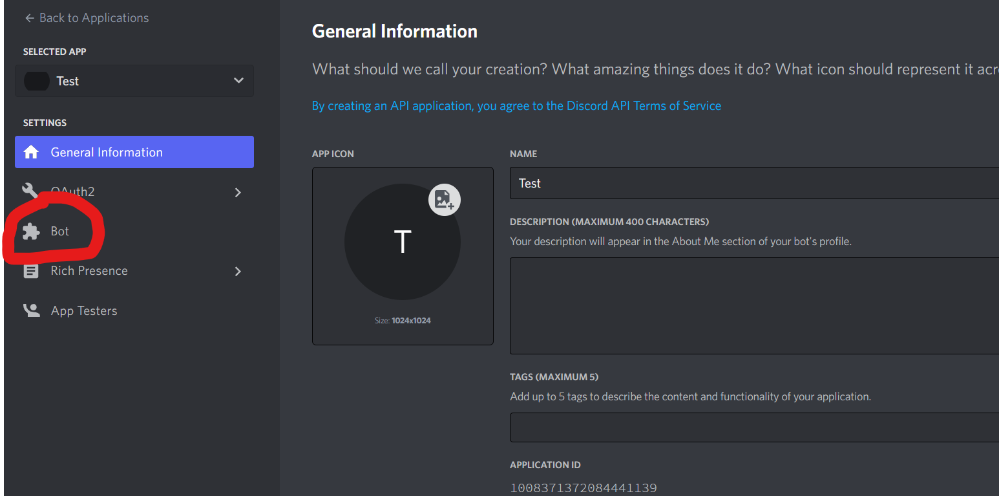

Getting Started
###############

Contents:
    * `Install package`_
    * `Create bot in Discord`_
    * `Coding with disspy`_

Install package
***************

How install disspy? Just type this lines in your command console

Windows::

    pip install -U disspy

Lunix::

    sudo pip install -U disspy

MacOs::

    python3 -m pip install -U disspy

Now you can go next

Create bot in Discord
*********************

For starting creating bots, you need create bot on
`official Discord Developer Portal <https://discord.com/developers/applications>`_

.. image:: images/1.png

Click "New application" button

.. image:: images/2.png

Come on with name and click "Create"

.. image:: images/3.png

Click "Bot" section

Click "Add bot"

.. image:: images/5.png

Argee with warning

.. image:: images/6.png

Click "Reset token"

.. image:: images/7.png

Copy token

.. image:: images/8.png

Coding with disspy
******************

Now let's coding!!!

*This is creating bot code*::

    import disspy

    token = "YOUR_COPIED_TOKEN"

    bot = disspy.DisBot(token=token, application_id=application_id)  # You created bot!

You can add any event using ``on() method``::

    @bot.on("ready")
    async def on_ready():
        print("Hi!")

This code print "Hi!" when bot becomes ready in Discord Gateway

In end of file you MUST type this code::

    bot.run()

This is very important because this method run bot in Discord! Well...
You are ready for coding with disspy.