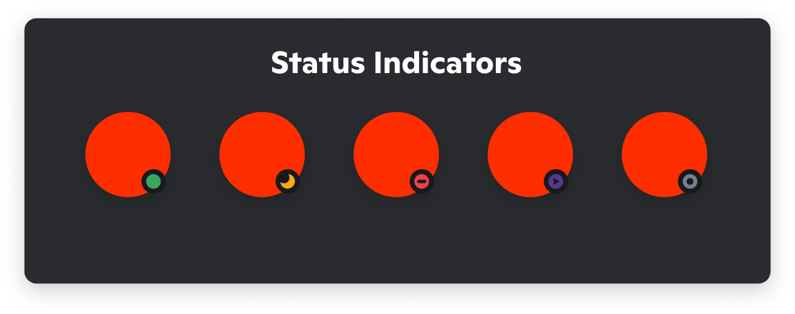

Bot
###

Contents:
    * `DisBot`_
    * `DisBotStatus`_
    * `DisBotEventType`_

DisBot
******

::

    class DisBot(token: Snowflake[str], status: Optional[TypeOf(DisBotStatus)],
                 flags: Optional[TypeOf(DisFlags)], debug: Optional[bool] = False,
                 activity: Optional[Union[Activity, dict]])

``token`` -> Token of bot from Discord Developer Portal

``status`` -> Key of `DisBotStatus`_ object. Bot status in Discord (for example, "online")

.. note::
    Default is ``DisBotStatus.ONLINE``

``flags`` -> Key of DisFlags. Special privellegions for bot (for example, DisFlags.messages() for on_message() events, or DisFlags.reactions() for on_reaction() events)

.. note::
    Default is ``DisFlags.default()``

``debug`` -> Enable debug in console

.. note::
    Default is ``False``

``activity`` -> Bot activity in Discord (For example, ``playing in Disspy``)

.. note::
    Default is ``None``

@on()
=====

::

    @on(event_type: Event(DisBotEventType, str)) -> Wrapper

Registering events with event type and function

Example::

    @bot.on("ready")
    async def on_ready():
        print("I'm ready!")

Params:
    ``event_type: str`` -> Key of `DisBotEventType`_ 

Returns:
    ``Wrapper``

add_event()
===========

::

    def add_event(event_type: Event(DisBotEventType, str), func: Callable) -> NoReturn

Registering events with event type and function

Example::

    async def on_ready():
        print("I'm ready!")
    
    bot.add_event("ready", on_ready)

Params:
    ``event_type: str`` -> Key of `DisBotEventType`_

    ``func: Callable`` -> `Callable <https://docs.python.org/3/library/typing.html#callable>`_ argument. function for event

Returns:
    ``None``

@on_ready()
===========

::

    @on_ready() -> Wrapper

Register on_ready() event

Example::

    @bot.on_ready()
    async def on_ready():
        print(f"Logged by {bot.user.fullname}")

Params:
    ``None``

Returns:
    ``Wrapper``

@on_message()
=============

::

    @on_message(event_type: str) -> Wrapper

Register on_message() events

Example::

    @bot.on_message("create")
    async def on_messagec(message: disspy.DisMessage):
        await message.channel.send(f"Channel id: {message.channel.id}")

Params:
    ``event_type: str`` -> Key of ["create", "update", "delete"] list

Returns:
    ``Wrapper``

@on_dm_message()
================

::

    @on_dm_message(event_type: str) -> Wrapper

Register on_dmessage() events

Example::

    @bot.on_dm_message("update")
        async def on_dmessageu(message: disspy.DmMessage):
            await message.channel.send("Dota 2 - 👎🏼")

Params:
    ``event_type: str`` -> Key of ["create", "update", "delete"] list

Returns:
    ``Wrapper``

@on_channel()
=============

::

    @on_channel(channel_id: ChannelId) -> Wrapper

Register on_channel() event (on_messagec() event, but in one channel)

Example::

    @bot.on_channel(955869165162479648)
    async def on_channel(message: disspy.DisMessage):
        await message.reply("Hi")

Params:
    ``channel_id: int`` -> Channel id for event

Returns:
    ``Wrapper``

@slash_command()
================

.. warning::
    For application commands your bot needs have ``application.commands`` scope

::

    @slash_command(name: str, description: str, options: Optional[List[Option]])
                   -> Union[Wrapper, None]

Create `Slash command. <application_commands.html#slash-commands>`_

Example::

    @bot.slash_command(name="test", description="Example")
    async def test(ctx: disspy.Context):
        await ctx.send("Test!")

Params:
    ``name: str`` -> Name of command

    ``description: str`` -> Description of command

    ``options: Optional[List[Option]]`` -> List with command options

    .. note::
        Default is ``None``

Args for event:
    ``ctx`` -> `Context <application_commands.html#context>`_ object. Command context

Returns:
    ``Union[Wrapper, None]`` -> Wrapper if application_id != 0 else None and error

More info in `this page <application_commands.html#slash-commands>`_

add_slash_command()
===================

.. warning::
    For application commands your bot needs have ``application.commands`` scope

::

    def add_slash_command(command: SlashCommand) -> NoReturn

Create command from `Slash command <application_commands.html#slash-commands>`_ object.

Example::

    async def func(ctx: Context):
        await ctx.send("Test!")

    bot.add_slash_command(SlashCommand(name="test", description="Dispy is good!", cmd=func))

Params:
    ``command`` -> `Slash command <application_commands.html#slash-commands>`_ object. Command that needs for register

Returns:
    ``None``

@user_command()
===============

.. warning::
    For application commands your bot needs have ``application.commands`` scope

::

    def user_command(name: str) -> Wrapper

Create `User command. <application_commands.html#user-commands>`_

Example::

    @bot.user_command("info")
    async def info(ctx: Context, user: DisUser):
        await ctx.send(f"Fullname: {user.fullname}")

Params:
    ``name: str`` -> Name of user command

Args for event:
    ``ctx`` -> `Context <application_commands.html#context>`_ object. Command context

    ``user`` -> Resolved user

Returns:
    ``Wrapper``

add_user_command()
==================

.. warning::
    For application commands your bot needs have ``application.commands`` scope

::

     def add_user_command(command: UserCommand) -> NoReturn

Create command from `User command <application_commands.html#user-commands>`_ object.

Example::

    async def func(ctx: Context, user: DisUser):
        await ctx.send(user.id)

    bot.add_user_command(UserCommand(name="test", cmd=func))

Params:
    ``command`` -> `User command <application_commands.html#user-commands>`_ object. Application command object

Returns:
    ``None``

@message_command()
==================

.. warning::
    For application commands your bot needs have ``application.commands`` scope

::

    def message_command(self, name: str) -> Wrapper

Create `Message command. <application_commands.html#message-commands>`_

Example::

    @bot.user_command("info")
    async def info(ctx: Context, message: disspy.DisMessage):
        await ctx.send(f"Message content: {message.content}")

Params:
    ``name: str`` -> Name of message command

Args for event:
    ``ctx`` -> `Context <application_commands.html#context>`_ object. Command context

    ``message`` -> Message

Returns:
    ``Wrapper``

add_message_command()
=====================

.. warning::
    For application commands your bot needs have ``application.commands`` scope

::

    def add_message_command(command: MessageCommand) -> NoReturn

Create command from `Message command <application_commands.html#message-commands>`_ object.

Example::

    async def func(ctx: Context, message: DisMessage):
        await ctx.send(f"Message content: {message.content}")

    bot.add_message_command(MessageCommand(name="test", cmd=func))

Params:
    ``command`` -> `Message command <application_commands.html#message-commands>`_ object. Application command object

Returns:
    ``None``

add_application_command()
=========================

.. warning::
    For application commands your bot needs have ``application.commands`` scope

::

    def add_application_command(command: ApplicationCommand) -> NoReturn

Create command from Application command object.

Example::

    async def func(ctx: Context):
        await ctx.send("Hi?")

    bot.add_application_command(ApplicationCommand(type=ApplicationCommandType.TEXT_INPUT, name="test", cmd=func))

Params:
    ``command`` -> Application command object

Returns:
    ``None``

run()
=====

::

    def run(status: Optional[DisBotStatus | str], activity: Optional[Activity | dict]) -> NoReturn

Run the bot in Discord Gateway

Example::

    bot.run(DisBotStatus.DND)

Params:
    ``status`` -> Key of `DisBotStatus`_

    ``activity`` -> Activity object. Discord activity in profile

Returns:
    ``None``

disconnect()
============

::

    async def disconnect() -> NoReturn

Disconnect from Discord Gateway

Example::

    await bot.disconnect()

Returns:
    ``None``

close()
=======

::

    async def close() -> NoReturn

Alternative of `disconnect()`_ method

send()
======

::

    async def send(channel_id: int, content: Optional[str],
                   embeds: Optional[List[DisEmbed]])

Send message to channel by id

Example::

    await bot.send(1001044473331060818, "I'm a bot created with disspy :)")

Params:
    ``channel_id`` -> Channel id where needs to send message

    ``content`` -> Message content

    ``embeds`` -> Message embeds

Returns:
    ``None``

get_channel()
=============

::

    def get_channel(channel_id: ChannelId) -> DisChannel | DisDmChannel

Get channel by id

Example::

    ch = bot.get_channel(1001044473331060818)
    await ch.send("Hi?")

Params:
    ``channel_id`` -> Channel id. ``int`` type

Returns:
    ``DisChannel``

    ``DisDmChannel``

get_thread()
============

::

    def get_thread(thread_id: ThreadId) -> DisNewsThread | DisThread | DisPrivateThread

Get thread by id

Example::

    th = bot.get_thread(1001044473331060818)
    await th.send("Hi?")

Params:
    ``thread_id`` -> Thread id. ``int`` type

Returns:
    ``DisNewsThread``

    ``DisThread``

    ``DisPrivateThread``

get_guild()
===========

::

    def get_guild(guild_id: GuildId) -> DisGuild

Get guild by id

Example::

    gl = bot.get_guild(955868993175035934)

Params:
    ``guild_id`` -> Guild id. ``int`` type

Returns:
    ``DisGuild``

change_activity()
=================

::

    async def change_activity(activity: Activity | dict) -> None

Change activity in bot profile

Example::

    await bot.change_activity(Activity("I'm working", ActivityType.WATCHING))

Params:
    ``activity`` -> Activity object. Bot activity

Returns:
    ``None``

DisBotStatus
************

::

    class DisBotStatus

Class with constants representes Discord bot statues

Variables:
    * ``ONLINE`` -> Online status (1st status on image)
    * ``DND`` -> Do not disturb status (3rd status on image)
    * ``INVISIBLE`` -> Invisible status (5th status on image)
    * ``IDLE`` -> Idle status (2nd status on image)

DisBotEventType
***************

Usage example::

    @bot.on(disspy.DisBotEventType.ON_MESSAGEC)
    async def on_messagec(message: disspy.DisMessage):
        await message.reply("This is example of usage DisBotEventType!")

Variables:
    * ``ON_MESSAGEC`` -> On message create
    * ``ON_MESSAGEU`` -> On message update
    * ``ON_MESSAGED`` -> On message delete
    * ``ON_DMESSAGEC`` -> On message create in DM channel
    * ``ON_DMESSAGEU`` -> On message update in DM channel
    * ``ON_DMESSAGED`` -> On message delete in DM channel
    * ``ON_READY`` -> On ready
    * ``ON_CLOSE`` -> On close
    * ``ON_REACTION`` -> On reaction add
    * ``ON_REACTIONR`` -> On reaction remove
    * ``ON_TYPING`` -> On typing start
    * ``ON_DM_TYPING`` -> On typing start in DM channel

ON_MESSAGEC
===========

Represention of Gateway "MESSAGE_CREATE" event

Args for event:
    message -> `DisMessage <message.html#dismessage>`_ object. Message that was created

ON_MESSAGEU
===========

Represention of Gateway "MESSAGE_UPDATE" event

Args for event:
    message -> `DisMessage <message.html#dismessage>`_ object. Message that was updated

ON_MESSAGED
===========

Represention of Gateway "MESSAGE_DELETE" event

Args for event:
    event -> `MessageDeleteEvent <message.html#messagedeleteevent>`_ object. Message deleting event

ON_DMESSAGEC
============

Represention of Gateway "MESSAGE_CREATE" event only in DM channel

Args for event:
    message -> `DmMessage <message.html#dmmessage>`_ object. Message that was created

ON_DMESSAGEU
============

Represention of Gateway "MESSAGE_UPDATE" event only in DM channel

Args for event:
    message -> `DmMessage <message.html#dmmessage>`_ object. Message that was updated

ON_DMESSAGED
============

Represention of Gateway "MESSAGE_DELETE" event only in DM channel

Args for event:
    event -> `DmMessageDeleteEvent <message.html#dmmessagedeleteevent>`_ object. Message deleting event

ON_READY
========

Represention of Gateway "READY" event

Args for event:
    ``None``

ON_CLOSE
========

Will be called when calling ``DisBot.__del__`` function

Args for event:
    ``None``

ON_REACTION
===========

Represention of Gateway "REACTION_ADD" event

Args for event:
    reaction: DisReaction object. Reaction that was added

ON_REACTIONR
============

Represention of Gateway "REACTION_REMOVE" event

Args for event:
    reaction: DisRemovedReaction object. Reaction that was removed

ON_TYPING
=========

Represention of Gateway "TYPING_START" event

Args for event:
    ``user``: DisUser object. User who started typing

    ``channel``: DisChannel object. Channel where typing was started

ON_DM_TYPING
============

Represention of Gateway "TYPING_START" event only in DM channel

Args for event:
    ``user``: DisUser object. User who started typing

    ``channel``: DisDmChannel object. Channel where typing was started
